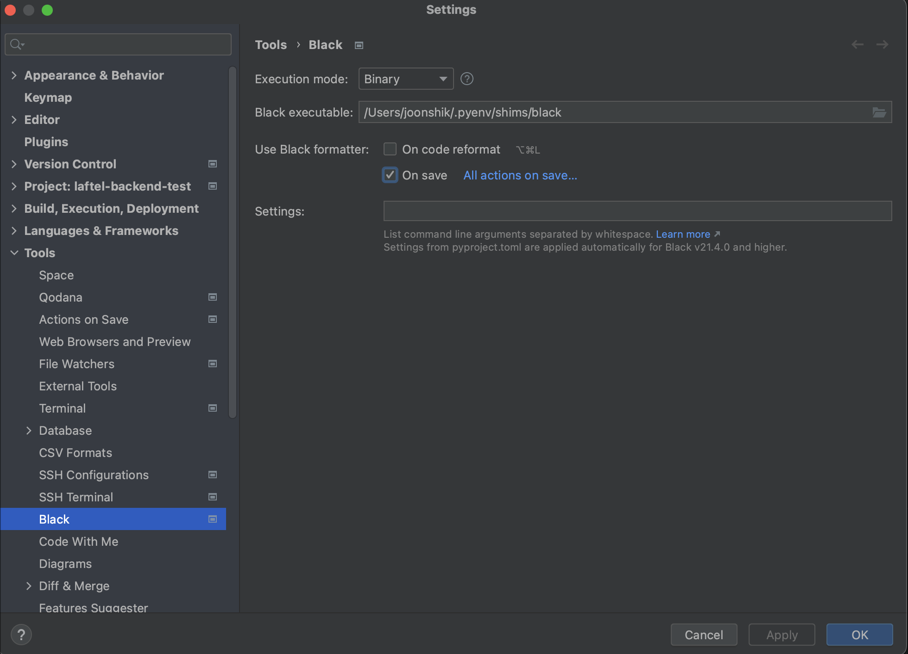

<!--more-->
## 코드 스타일이란?
코드 스타일은 소스 코드 작성 시 따르는 일련의 규칙과 가이드라인을 말합니다.  
개인 프로젝트에서는 개인의 선호에 따라 코드 스타일을 정하여도 문제가 없지만 공동 작업을 하는 협업 프로젝트에서는 개발자간 상이한 코드 스타일이 코드를 빠르게 파악하는데 어려움을 줍니다.  

따라서 팀에서는 여러 개발자들이 통일된 코딩 스타일을 갖도록 규약을 정하는데 이것을 `코딩 컨벤션(Coding Convention)`이라고 합니다.  

python의 경우 [PEP8](https://peps.python.org/pep-0008/)을 통해 코드 스타일 규약을 정해두었고 구글과 같은 팀에서도 자신만의 [구글 스타일 가이드](https://google.github.io/styleguide/)를 가지고 있습니다.  

## Black이란?
Black은 Python의 엄격한 코드 스타일 자동화 도구입니다.  

Black은 PEP8에 기반한 엄격한 코드 스타일 자동화를 제공하며 사용자들이 코드 스타일에 대해 고민하고 논의하지 않고 개발에만 집중할 수 있도록 해줍니다.  

즉, 블랙은 모든 블랙으로 포메팅된 프로젝트를 동일한 구조를 가지도록 하여 개발자들이 내용에만 집중할 수 있도록 해줍니다.  

[Black 플레이그라운드](https://black.vercel.app)에서 Black에서 제공하는 포메팅을 체험해볼 수 있습니다.

## Black 설치 방법
pip를 통하여 손쉽게 Black을 설치할 수 있습니다.  

```bash
pip install black
```

## Black 사용 방법
```example.py
x = {'a': 30, 'b': 20,
'c': 10}

def func_a():
    print('func a')

def func_b():
  print('func b')

if __name__ == '__main__':
      func_a()
      func_b()
```

위와 같이 indent가 뒤죽박죽으로 작성된 가독성이 떨어지는 파일을 블랙으로 포메팅해보도록 하겠습니다.

```bash
black example.py
> reformatted example.py

All done! ✨ 🍰 ✨
1 file reformatted.
```

```example.py
x = {"a": 30, "b": 20, "c": 10}


def func_a():
    print("func a")


def func_b():
    print("func b")


if __name__ == "__main__":
    func_a()
    func_b()
```
Black을 통해 일정한 방식으로 포메팅 된 것을 확인할 수 있습니다.  

`black {DIRECTORY}`를 통해 특정 디렉토리내에 모든 파일에 대해 Black 포메팅을 수행할 수도 있습니다.

## Black 커스텀 설정
black 명령어의 옵션을 통해 커스텀한 설정을 할 수도 있고 toml 파일을 통해 config를 설정할 수도 있습니다.
### 옵션을 통한 설정
```example.py
x = {'a': 30, 'b': 20,
'c': 10}

def func_a():
    print('func a')

def func_b():
  print('func b')

if __name__ == '__main__':
      func_a()
      func_b()
```

```bash
black example.py --skip-string-normalization
```

위의 example.py 파일을 다시 포메팅해보면 이번에는 `'`을 `"`로 변환하는 작업을 수행하지 않는 것을 볼 수 있습니다.

```example.py
x = {'a': 30, 'b': 20, 'c': 10}


def func_a():
    print('func a')


def func_b():
    print('func b')


if __name__ == '__main__':
    func_a()
    func_b()
```

### toml 파일 설정
`pyproject.toml` 파일은 python의 패키징을 위한 설정 파일입니다.  

`pyproject.toml` 파일의 [tool.black] 테이블을 통해 Black 설정이 가능합니다.  

```pyproject.toml
[tool.black]
skip-string-normalization = true
```

위와 같이 `pyproject.toml` 파일을 작성하고 black 명령어를 실행시키면 이전에 `black example.py --skip-string-normalization`을 실행한 것과 동일하게 동작하는 것을 확인할 수 있습니다.  

이외에도 `exclude` 옵션을 통해 불필요한 파일을 포메팅하지 않거나 `line-length`를 통해 라인 별 최대 글자 수를 수정할 수도 있습니다.  

## 자동화 설정
매번 Black 명령을 수동으로 실행할 수도 있지만 IDE 설정이나 Git Hook의 pre-commit 설정, 아니면 Github Action 등에 설정하며 자동화할 수도 있습니다.

### Pycharm 설정
`Preferences or Settings -> Tools -> Black`에서 On save 옵션을 체크하여 매 저장마다 자동화된 포메팅을 제공할 수 있습니다.



### Git Hook Pre-Commit 설정
`pre-commit`은 `git commit`을 하기 전에 자동으로 설정해둔 작업들이 실행되는 툴입니다.  

`.git/hooks/pre-commit` 파일을 통하여 작업이 진행되므로 직접 해당 파일을 생성할 수도 있지만 python에서 pre-commit 설정을 돕는 라이브러리를 통해 설정하도록 하겠습니다.  

```bash
pip install pre-commit
```

다음과 같이 `.pre-commit-config.yaml` 파일을 생성해줍니다.  

```.pre-commit-config.yaml
repos:
  - repo: https://github.com/psf/black-pre-commit-mirror
    rev: 24.4.2
    hooks:
      - id: black
```

다음 명령어를 통해 `.git/hooks/pre-commit`을 생성합니다.

```bash
pre-commit install
```

그러면 다음과 같이 pre-commit 파일이 생성되어있는 것을 확인할 수 있습니다.  

```bash
cat .git/hooks/pre-commit
```

```example.py
x = {'a': 30, 'b': 20,
'c': 10}

def func_a():
    print('func a')

def func_b():
  print('func b')

if __name__ == '__main__':
      func_a()
      func_b()
```

기존 포메팅되지 않은 `example.py` 파일을 커밋해보도록 하겠습니다.

```bash
git add example.py
git commit -m 'Add: example.py'

> black....................................................................Failed
- hook id: black
- files were modified by this hook

reformatted example.py

All done! ✨ 🍰 ✨
1 file reformatted.
```

그러자 위와 같이 black에서 실패했다는 로그가 출력되고 `example.py`가 포메팅되어있는 것을 확인할 수 있습니다.

```bash
git add example.py
git commit -m 'Add: example.py'
```

다시 commit을 하자 포메팅된 파일이 잘 등록되는 것을 확인할 수 있습니다.  

### Github Action 등록
`.github/workflows/black.yml` 파일을 깃허브 레포지토리에 생성하여 깃허브 액션 워크플로우를 수행할 수 있습니다.  

```black.yml
name: Black

on: [push, pull_request]

jobs:
  black:
    runs-on: ubuntu-latest
    steps:
      - uses: actions/checkout@v3
      - uses: psf/black@stable
```

그러면 매번 Push와 PR에서 Black을 체크할 수 있습니다.
