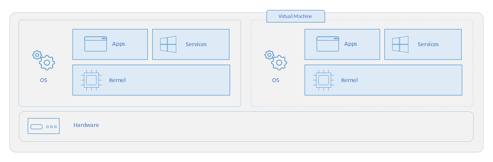
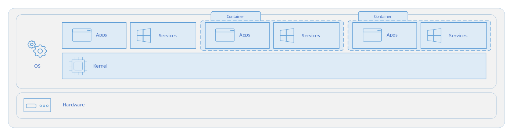

<!--more-->
## 가상화
가상화는 물리적 하드웨어 리소스를 추상화하여 논리적인 리소스로 변환하여 물리적 하드웨어를 보다 효율적으로 활용할 수 있도록 하는 기술입니다.  

즉, 하나의 컴퓨터를 마치 여러 대의 컴퓨터처럼 나누어 사용하는 방법입니다.  

이는 하나의 컴퓨터에서 하나의 서버를 실행하는 것이 아닌 자원 사용량에 따라 하나의 컴퓨터에서 여러 서버를 실행할 수 있도록 합니다.  

### 가상화 장점
가상화는 다음과 같은 장점을 제공합니다.  
- 효율적인 리소스 사용: 가상화를 통해 하나의 컴퓨터에서 하나의 서버를 실행하는 것이 아니라 필요에 따라 서버를 사용하고 반환하는 방식으로 활용하며 더 효율적으로 리소스를 사용할 수 있습니다.  
- 자동화된 IT 관리: 물리적 리소스를 가상화하여 소프트웨어 도구로 관리할 수 있게 됩니다. 이는 가상 머신에 대한 템플릿을 정의하고 일관된 방식으로 인프라를 복제할 수 있게 합니다.
- 신속한 재해 복구: 물리적 리소스에 문제가 발생하는 경우 물리적 서버를 수리하는데 많은 시간이 소요됩니다. 하지만 가상화된 환경에서는 다른 리소스를 통해 즉각적인 복원이 가능합니다.  

## Virtual Machine (VM)

가상 머신(VM)은 실행 중인 어플리케이션과 운영 체제를 포함하여 컴퓨터와 거의 동일한 모든 기능을 수행할 수 있는 컴퓨터의 가상화된 인스턴스입니다.  

가상 머신은 `하이퍼바이저`를 통해 컴퓨팅 리소스를 할당받습니다. 하이퍼바이저는 물리적 머신의 리소스를 추상화하여 가상 머신에 할당하는 소프트웨어입니다.  

각각의 가상 머신은 자신만의 OS(`Guest OS`)를 가지기 때문에 다른 가상 머신과 완전히 격리되어있으며 개별의 커널을 가지게 됩니다.  

## 컨테이너

컨테이너는 호스트 운영 체제에서 어플리케이션을 실행하기 위해 격리된 경량 인스턴스입니다.  

컨테이너는 기존 호스트 OS의 커널을 공유하며 유저 모드의 어플리케이션을 격리하여 사용자가 개별 어플리케이션을 사용하고 있는 것처럼 제공합니다.  

### 컨테이너 vs VM

컨테이너와 VM은 다음과 같이 정의할 수 있습니다.  
#
OS(VM) = kernel + filesystem/libraries  
Image(Container) = filesystem/libraries  
 

컨테이너와 가상 머신은 각각 장단점을 가지고 있고 필요한 상황에 따라 선택하여 사용하거나 혼합하여 사용하기도 합니다.  

AWS, GCP 등의 CSP에서는 가상 머신 기반으로 인프라를 구성하고 컨테이너 형태로 어플리케이션을 구성하여 제공하고 있습니다. 

#### 무거운 리소스와 부팅 시간
가상 머신은 개별 커널을 보유하기 때문에 메모리와 디스크 사용량이 많고 개별 커널을 부팅해야하므로 부팅 시간또한 매우 깁니다.  

반면 컨테이너는 호스트 OS의 커널을 공유하므로 메모리와 디스크 샤용량이 적고 빠르게 시작될 수 있다는 장점이 있습니다.  

컨테이너는 경량화되어있어 좋은 이식성을 가지고 있어 도커 및 쿠버네티스 등에서 다양하게 활용되고 있습니다.  

#### 호스트 OS 의존성
가상 머신은 개별 커널 위에서 동작하기 때문에 다양한 운영 체제를 동일한 호스트에서 수행할 수 있습니다. 예를 들어, Windows 서버 위에서 Linux 가상 머신을 실행시킬 수 있습니다.  

반면 컨테이너는 호스트 OS의 커널에 의존하므로 다양한 운영 체제를 활용할 수는 없습니다.  

#### 보안 및 격리
가상 머신은 하드웨어 수준에서 완전히 격리되어 보안 및 안정성이 매우 높습니다.  
하나의 가상 머신에서 발생한 문제가 다른 가상 머신에 영향을 끼치지 않습니다.  

반면 컨테이너는 고립된 파일 시스템, 네트워크, 프로세스 공간 등을 가지긴 하지만 비교적 VM에 비하여 낮은 격리 수준을 갖습니다.  

### 컨테이너 표준
컨테이너 기술이 발전함에 따라, 다양한 표준과 규격이 도입되었습니다.  
이러한 표준은 컨테이너 이미지의 형식과 실행 환경을 정의하고, 상호 운용성을 보장하며, 컨테이너 생태계를 더욱 견고하고 통합된 환경으로 발전시키는 데 기여하고 있습니다.  

`OCI(Open Container Initiative)`는 이러한 컨테이너의 표준입니다.  

도커는 이러한 OCI 표준을 기반으로 `containerd`를 개발하여 도커 엔진에 탑재하고 있습니다.  

Red Hat, Intel, IBM에서는 OCI 표준을 준수하는 `CRI-O`를 제안하였습니다.  

이렇게 다른 컨테이너 실행 환경인 `containerd`와 `CRI-O` 모두 `OCI 표준`을 준수하기에 쿠버네티스 등에서는 해당 런타임으로 생성된 컨테이너 이미지를 모두 지원하고 있습니다.  

## 컨테이너의 구조
컨테이너는 `chroot`라는 리눅스 시스템 콜로 시작하게 되었습니다.  

`chroot`는 프로세스 루트 디렉토리를 변경하는 리눅스 시스템 콜로 ssh 등으로 접속한 유저가 특정 디렉토리에만 접근 가능하도록 제어하는 용도로 설계되었습니다.  
`chroot`는 Change Root Directory의 약어로 특정 프로세스의 루트 디렉토리를 설정하면 사용자가 해당 루트 디렉토리 밖으로 나가지 못하도록 가두는 명령어입니다.  

`chroot`로 갇힌 프로세스는 해당 디렉토리 밖의 라이브러리 등을 사용하지 못하므로 기본적인 동작을 할 수 없었고, 필요한 커맨드 프로그램과 라이브러리 등을 경로에 함께 추가해야 합니다.  
하지만 매번 모든 라이브러리와 프로그램 등을 직접 복사해 넣는 것은 복잡한 과정이었고 이를 해결하기 위해 프로그램 실행에 필요한 라이브러리와 프로그램을 미리 모아둔 `이미지`를 사용하게 됩니다.  

하지만 `chroot`는 탈옥이 가능하고 격리되지 않으며 루트 권한 및 리소스 무제한 문제 등 다양한 문제를 가지고 있었고 컨테이너는 `chroot`를 사용하지 않고 linux의 기본 명령어인 `pivot_root`, `namespace`, `cgroups`로 컨테이너를 생성하게 됩니다.  

즉, 컨테이너는 리눅스 명령어로 생성된 개별 프로세스 입니다.  
### pivot root
`pivot_root`는 리눅스 시스템에서 루트 파일 시스템을 변경하는 명령어입니다.  

`chroot`의 경우 루트 파일 시스템이 동일하기 때문에 탈옥이 가능하다는 문제가 있습니다.  
`pivot_root`를 통해 루트 파일 시스템을 변경하여 탈옥을 막을 수 있습니다.  

이때, 변경되는 파일 시스템이 호스트에 영향을 주지 않기 위해서 마운트 네임스페이스를 분리하게 됩니다.  

### 네임스페이스
리눅스 커널의 네임스페이스는 프로세스에 격리된 환경과 리소스를 제공합니다.  

네임스페이스는 다음과 같은 특징이 있습니다.
- 네임스페이스 안에서의 변경은 내부의 프로세스에만 보이고 외부 프로세스에는 보이지 않습니다.
- 모든 프로세스는 네임스페이스 타입 별로 특정 네임스페이스에 속합니다.
- 자식 프로세스는 부모 프로세스의 네임스페이스를 상속받습니다.

네임스페이스는 격리하는 자원에 따라 다음과 같이 구분됩니다.  

#### 마운트 네임스페이스
마운트 네임스페이스는 프로세스와 그 자식 프로세스에게 다른 파일 시스템 마운트 포인트를 제공합니다.  
네임스페이스의 프로세스들에게 보여지는 마운트 포인트를 격리시키고 격리된 마운트 포인트들은 각 프로세스에게 단일 디렉토리 구조로 보이게 됩니다.  

이때 마운트 네임스페이스의 종류는 다음과 같습니다.  
- private: 각 마운트 포인트가 다른 마운트 포인트에 반영되지 않는 방법
- shared: 각 마운트 포인트가 다른 마운트 포인트에 반영되어 보여지는 방법
- slave: 파일시스템 하위에서 새로운 마운트는 파일시스템에 반영되나, 반대는 반영되지 않는 방법

```bash
# 마운트할 디렉터리를 생성
$ mkdir /tmp/mount_ns

# 현재 bash 프로세스를 마운트 네임스페이스로 이동
# unshare은 네임스페이스 생성 명령어이고 -m이 마운트 네임스페이스를 생성하도록 지정
$ sudo unshare -m /bin/bash

# 현재 네임스페이스의 관련 inode 번호 확인
$ readlink /proc/$$/ns/mnt
mnt:[4026532226]

# tmpfs이라는 임시 파일 시스템 타입으로 마운트
$ mount -t tmpfs tmpfs /tmp/mount_ns

# 임시 파일 생성
$ touch /tmp/mount_ns/a
$ ls /tmp/mount_ns/
a

# 새로 생성한 마운트 지점 확인
$ mount | grep mount_ns
tmpfs on /tmp/mount_ns type tmpfs (rw,relatime,seclabel)
```

새로운 터미널에서 마운트 지점을 확인하면 기존 터미널이 마운트 네임스페이스로 격리되었기 때문에 새로운 터미널에서 보이지 않는 것을 확인할 수 있습니다.

```bash
# 새로운 터미널
# 다른 네임스페이스이기에 네임스페이스의 inode 번호가 다른 것을 확인할 수 있다.
$ readlink /proc/$$/ns/mnt
mnt:[4026531841]

# ls를 사용하더라도 디렉토리는 보이지만 격리된 a 파일은 보이지 않는다.
$ ls /tmp/mount_ns/

# 마운트 지점 확인 또한 되지 않는다.
$ mount | grep mount_ns
```

#### UTS 네임스페이스
UTS 네임스페이스는 호스트 명을 서버와 다르게 사용할 수 있도록 합니다.  

UTS는 Unix Time Sharing인 시분할의 약자로 여러 사용자의 요청을 CPU 시간을 쪼개서 사용하며 여러 사용자의 환경 별로 호스트 명이나 도메인 명을 구분할 수 있도록 격리를 제공합니다.  

```bash
$ hostname
ubuntu1804

$ readlink /proc/$$/ns/uts
uts:[4026531838]

# 현재 bash 프로세스에서 uts 네임스페이스를 격리
$ sudo unshare --uts /bin/bash

# 호스트 명 변경
$ hostname MyHost

$ hostname
MyHost

$ readlink /proc/$$/ns/uts
uts:[4026532227]
```

새로운 터미널에서는 호스트 명이 유지되는 것을 확인할 수 있습니다.  

```bash
$ readlink /proc/$$/ns/uts
uts:[4026531838]

$ hostname
ubuntu1804
```

#### IPC 네임스페이스
IPC 네임스페이스는 Inter Process Communication을 지원하는 공유 메모리 및 메세지 큐 등의 리소스에 대한 격리를 제공합니다.  
```bash
$ sudo unshare --ipc /bin/bash

# 공유 메모리 생성
$ ipcmk -M 2000
Shared memory id: 0

$ ipcs -m
------ Shared Memory Segments --------
key        shmid      owner      perms      bytes      nattch     status
0x809712ea 0          root       644        2000       0

$ readlink /proc/$$/ns/ipc
ipc:[4026531839]
```

새로운 터미널에서 공유 메모리를 확인하면 다음과 같습니다.  

```bash
# 공유 메모리 생성
$ ipcmk -M 1000
Shared memory id: 0

$ ipcs -m
------ Shared Memory Segments --------
key        shmid      owner      perms      bytes      nattch     status
0xdf4a6453 0          root   644        1000       0

$ readlink /proc/$$/ns/ipc
ipc:[4026532228]
```

#### PID 네임스페이스
pid는 프로세스 별로 부여되는 고유 번호로 프로세스 트리 최상위는 init 프로세스라는 pid 1을 갖는 프로세스가 존재합니다.  

PID 네임스페이스는 pid 리소스를 격리합니다.  

PID 네임스페이스를 격리하면 격리된 컨테이너 안에도 pid 1로 시작하는 트리 구조를 가지게 됩니다.  
PID 네임스페이스는 부모 네임 스페이스와 자식 네임스페이스가 중첩되는 구조로 자식 네임스페이스의 모든 프로세스들은 부모 네임스페이스의 pid와 해당 네임스페이스의 pid를 모두 가지게 됩니다.  

```bash
$ echo $$
646748
$ sudo unshare --pid --fork --mount-proc /bin/bash
$ echo $$
1

// 현재 실행중인 프로세스가 컨테이너의 프로세스만 보인다.
$ ps aux
USER         PID %CPU %MEM    VSZ   RSS TTY      STAT START   TIME COMMAND
root           1  0.0  0.5 233096  5112 pts/1    S    14:24   0:00 /bin/bash
root          20  0.0  0.2 232520  2780 pts/1    R+   14:25   0:00 ps aux
```

#### cgroup 네임스페이스
cgroup은 프로세스에 할당할 시스템 리소스(CPU, Memory, Network)에 대한 제어를 제공합니다.  

cgroup은 파일시스템을 기반으로 파일시스템에 디렉토리를 만들고 파일을 수정하는 방식으로 시스템 리소스를 관리합니다.  
이 때무에 컨테이너에서 cgroup이 관리하는 파일시스템에 접근하게 되면 호스트의 시스템 리소스를 건드릴 수 있습니다.  
cgroup 네임스페이스는 cgroup 파일시스템(/sys/fs/cgroup)을 격리합니다.  

#### 네트워크 네임스페이스
네트워크 네임스페이스는 컨테이너의 네트워크를 가상화하여 네트워크 상 별도의 노드로 취급하도록 합니다.  

```bash
$ sudo unshare --net /bin/bash
$ lsns -t net -p $$
NS TYPE NPROCS    PID USER    NETNSID NSFS COMMAND
4026532226 net       2 655964 root unassigned      /bin/bash
$ lsns -t net -p 1
NS TYPE NPROCS PID USER    NETNSID NSFS COMMAND
4026531840 net     113   1 root unassigned      /usr/lib/systemd/systemd --switc
```

NS는 네트워크 네임스페이스의 inode값으로 현재 프로세스와 init 프로세스의 inode 값이 서로 다름을 확인할 수 있습니다.  
#### User 네임스페이스
User 네임스페이스는 유저가 컨테이너 안에서만 루트 유저로 동작할 수 있도록 합니다.  

각 User 네임스페이스는 독립적인 사용자 및 그룹 ID를 할당하여 호스트 시스템의 사용자와 격리된 환경을 제공합니다.  

## 컨테이너 계층화
컨테이너 이미지는 컨테이너 내부에서 프로그램을 실행하는데 필요한 모든 파일을 캡슐화하는 바이너리 패키지입니다.  

이미지는 일련의 파일 시스템 계층으로 구성되어있어 각 계층은 파일 시스템의 이전 계층으로부터 파일을 추가, 제거 또는 수정하는 오버레이 파일 시스템을 갖습니다.  

컨테이너 이미지는 일련의 파일 시스템 계층으로 구성되어 있어 이전 계층을 상속하고 수정합니다.  

도커의 모든 이미지 레이어는 `var/lib/docker/overlay2`에 저장되고 해시값을 통해 구분된다.
Dockerfile의 FROM, RUN, COPY 명령은 새로운 레이어를 생성합니다.  


이미지 A: 레이어 A -> 레이어 B -> 레이어 C  
이미지 B: 레이어 A -> 레이어 B -> 레이어 C -> 레이어 D  
이미지 C: 레이어 A -> 레이어 B -> 레이어 E  
 

위와 같이 이미지 3개가 존재한다고 할 때, 이미지 A를 삭제하더라도 레이어 A, B, C는 이미지 B에서 사용되고 있기 때문에 파일 시스템에서 지워지지 않고, 이미지 C를 추가로 생성할 때에 레이어 A와 B가 이미 다운로드 되어있기에 별도로 다운로드하거나 생성하지 않고 레이어 E만 만들게 됩니다.  

```Dockerfile
# Dockerfile A
FROM ubuntu

RUN apt-get update && apt-get upgrade -y

RUN apt-get install -y openssh-server
```
```Dockerfile
# Dockerfile B
FROM ubuntu

RUN apt-get update && apt-get upgrade -y && apt-get install -y openssh-server
```

만약 위와 같이 2개의 이미지가 존재한다면, 해당 이미지를 docker inspect 명령어를 통하여 보았을 때 레이어를 파악할 수 있습니다.  

```bash
$ docker inspect image_a
"RootFS": {
	"Type": "layers",
	"Layers": [
		"sha256:17ccff5b06b404f920af4557c0e2cb6ee5551b7136dc0cdb4f9aaf1bf71c643c",
		"sha256:ede334733a68a6091f2137efcdc0b86284885442db0c96cb72b0c47b27d74ed6",
		"sha256:47592da01660e3fb88cfbb307cbcd8faf61b879bf6fc2eaccae598d0a35ab53b"
		]
	},
```
```bash
$ docker inspect image_b
"RootFS": {
	"Type": "layers",
	"Layers": [
        "sha256:17ccff5b06b404f920af4557c0e2cb6ee5551b7136dc0cdb4f9aaf1bf71c643c",
        "sha256:d1bd4cf291b49e133ee9c9f4679f45fffe91e2cfca7a048466d67eebd7bef269"
		]
	},
```
위와 같이 기반 이미지의 레이어인 `sha256:17ccff5b06b404f920af4557c0e2cb6ee5551b7136dc0cdb4f9aaf1bf71c643c`을 공통으로 갖고 실행된 RUN 명령어마다 새로운 레이어가 추가되는 것을 확인할 수 있습니다.  