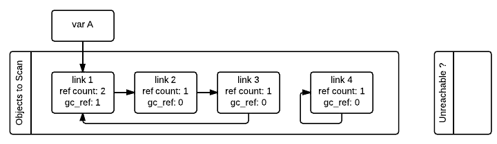

<!--more-->
## Garbage Collection?
가비지 컬렉션은 프로그래밍 언어에서 더 이상 필요하지 않은 객체를 자동으로 메모리에서 해제하는 메모리 관리 방법입니다.  

그렇다면, 가비지 컬렉션은 왜 필요한 것일까요?

### 수동 메모리 관리 방식의 문제점
C나 C++ 등의 프로그래밍 언어는 가비지 컬렉션 기능을 포함하지 않고 개발자가 `free`, `malloc`의 함수를 통해 수동으로 메모리 관리를 하도록 설계되었습니다.  
하지만 수동 메모리 관리 방식은 여러 어려움을 가지고 있습니다.  
- 메모리 누수: 할당한 메모리를 적절히 해제하지 않으면 불필요한 객체들이 남고 점차 더 많은 메모리를 차지하여 프로그램이 종료될 수 있습니다.  
- 이중 해제: 이미 해제된 메모리를 다시 해제하려고 하면 프로그램이 비정상적으로 동작하거나 종료될 수 있습니다.  
- Dangling Pointer: 메모리를 해제한 후에도 해당 메모리를 참조하는 포인터가 남아있는 경우 의도하지 않은 동작이 발생할 수 있습니다.  

가비지 컬렉션은 이러한 수동 메모리 관리 문제점을 해결하기 때문에 `Python`, `Java`, `C#`, `Go` 등의 언어는 자동 가비지 컬렉션을 내장하여 제공합니다.  

### 가비지 컬렉션의 단점
하지만 가비지 컬렉션도 몇가지 문제점을 가지고 있습니다.  
- 성능 오버헤드: 가비지 컬렉션을 위해 지속적으로 메모리를 확인하고 정리하는 작업을 수행하는 오버헤드가 발생합니다.  
- 메모리 오버헤드: 가비지 컬렉션을 위한 추가적인 메타데이터를 저장해야하므로 메모리 사용량이 증가합니다.
- 최적화 어려움: 가비지 컬렉션을 통해 메모리를 관리하므로 개발자가 메모리 할당과 해제를 세밀하게 제어할 수 없습니다. 따라서 최적화가 어려울 수 있습니다.  

## Python 가비지 컬렉션
### Reference Counting
Python에서 가장 기본적으로 사용하는 가비지 컬렉션 알고리즘입니다.  

각 객체는 참조된 횟수인 `reference count` 변수를 가집니다.  
객체는 참조될 때마다 reference count 값을 증가시키고 참조가 해재될 때마다 reference count를 감소시킵니다.  


`sys.getrefcount`를 통해 해당 객체가 얼마나 참조되고 있는지 확인할 수 있습니다.  
객체는 `sys.getrefcount`에 의해 참조되고 있으므로 참조 횟수는 +1만큼 추가되어 출력됩니다.


```python
>>> x = object()
>>> sys.getrefcount(x)
2
>>> y = x
>>> sys.getrefcount(x)
3
>>> del y
>>> sys.getrefcount(x)
2
```

`reference count` 값이 0이 되면 해당 객체는 더 이상 사용되지 않는 것으로 간주되어 메모리에서 해제됩니다.  

Python은 Reference Counting 방법을 통해 객체가 더 이상 필요하지 않으면 즉시 해제하는 간단하고 즉각적인 메모리 해제를 제공합니다.  

하지만, 단순한 Reference Counting 방법은 `순환 참조(Circular Reference)` 문제를 해결하지 못합니다.

### 순환 참조 문제
순환 참조란 두 개 이상의 객체가 서를 참조하여 참조가 순환을 이루는 상황을 말합니다.  
순환 참조가 발생하면 Reference Count로는 객체가 더 이상 사용되지 않는다는 것을 인지할 수 없습니다.  

```ex1.py
class A:
    def __init__(self):
        self.b = None
        print("A 객체 생성됨")

    def __del__(self):
        print("A 객체 삭제됨")

class B:
    def __init__(self):
        self.a = None
        print("B 객체 생성됨")

    def __del__(self):
        print("B 객체 삭제됨")

if __name__ == '__main__':
    a = A()
    b = B()

    b.a = a

    del a
    del b

    print('프로그램 종료')
```

위의 `ex1.py`의 경우 b 객체는 a를 참조하지만 a는 b를 참조하지 않아 순환 참조가 아닌 상황입니다.  
따라서 b의 reference count는 1이고 a의 reference count는 2가 됩니다.  

`del a`가 실행되면 a 객체를 가리키는 변수는 삭제되지만 a 객체는 b에서 가리키고 있기 때문에 reference count 값이 1이 되고 삭제되지 않습니다.  
`del b`가 실행되면 b 객체의 reference count가 0이 되며 삭제되며 a도 reference count가 0이 되며 삭제됩니다.  

```bash
$ python ex1.py
A 객체 생성됨
B 객체 생성됨
B 객체 삭제됨
A 객체 삭제됨
프로그램 종료
```

`del a`를 `del b`보다 먼저 실행했지만 b 객체가 먼저 삭제되는 것고 이후 프로그램이 종료되는 것을 확인할 수 있습니다.  

```ex2.py
class A:
    def __init__(self):
        self.b = None
        print("A 객체 생성됨")

    def __del__(self):
        print("A 객체 삭제됨")

class B:
    def __init__(self):
        self.a = None
        print("B 객체 생성됨")

    def __del__(self):
        print("B 객체 삭제됨")


if __name__ == '__main__':
    a = A()
    b = B()

    a.b = b
    b.a = a

    del a
    del b

    print('프로그램 종료')
```

위의 `ex2.py`의 경우 b 객체는 a를 참조하고 a는 b를 참조하여 순환 참조인 상황입니다.  
따라서 b와 a의 reference count는 2가 됩니다.  

`del a`가 실행되면 a 객체를 가리키는 변수는 삭제되지만 a 객체는 b에서 가리키고 있기 때문에 reference count 값이 1이 되고 삭제되지 않습니다.  

`del b`가 실행되면 b 객체를 가리키는 변수는 삭제되지만 b 객체는 a에서 가리키고 있기 때문에 reference count 값이 1이 되고 삭제되지 않습니다.  

```bash
$ python ex2.py
A 객체 생성됨
B 객체 생성됨
프로그램 종료
A 객체 삭제됨
B 객체 삭제됨
```

따라서 del 명령어로는 a와 b 객체가 삭제되지 않고, 프로그램이 종료된 이후 객체가 삭제됩니다.  
이를 통해 순환 참조 객체는 reference count를 통해 삭제할 수 없다는 것을 확인할 수 있습니다.  


위의 예제는 Python 코드 시각화 툴인 [Python Tutor](https://pythontutor.com/python-compiler.html#mode=edit)에서 확인하면 더 쉽게 이해할 수 있습니다.


### 순환 참조 해결
Python의 가비지 컬렉터인 `gc` 모듈은 주기적으로 힙 메모리를 검사하여 순환 참조로 인해 reference count가 0이 되지 않는 객체를 찾아내고 해제합니다.  

#### 순환 참조 판별
그렇다면, `gc` 모듈은 어떻게 순환 참조로 인해 reference count가 0이 되지 않는 접근 불가능한 객체를 판별할까요?  

우선, 순환 참조는 컨테이너 객체(array, dictionary, list, class)에서만 발생할 수 있습니다.  
따라서 gc 모듈은 컨테이너 객체에만 집중하게 됩니다.  

다음은 순환 참조중인 객체를 삭제하는 예제입니다.

```python
>>> import gc

>>> class Link:
...    def __init__(self, next_link=None):
...        self.next_link = next_link

>>> link_3 = Link()
>>> link_2 = Link(link_3)
>>> link_1 = Link(link_2)
>>> link_3.next_link = link_1
>>> A = link_1
# link_1, link_2, link_3가 삭제되더라도 A에서 여전히 참조중이므로 삭제되지 않음
>>> del link_1, link_2, link_3

>>> link_4 = Link()
>>> link_4.next_link = link_4
>>> del link_4

# 순환 참조중인 접근 불가능한 link_4 객체 수집 (객체의 __dict__ 객체도 함께 수집)
>>> gc.collect()
2
```

`link_1`, `link_2`, `link_3`는 서로 순환 참조하고 삭제되었지만 `A`가 `link_1`을 참조하고 있어 접근 가능하고 삭제되면 안되는 경우입니다.  

반면 `link_4`는 스스로를 참조하는 순환 참조 상황이지만 삭제되어 해제되어야 하는 경우입니다.  

우선 gc는 모든 컨테이너 객체를 스캔할 객체 리스트(`Objects to Scan`)에 저장합니다.  
저장된 모든 객체는 reference count 값을 복사하여 `gc_ref`라는 접근 불가능 여부 판별을 위한 추가 필드를 가지게 됩니다.  


이후 gc는 스캔할 객체 리스트를 순환하며 한 객체가 참조하는 다른 객체들의 `gc_ref`값을 1만큼 줄입니다.  

즉, 우선 `link_1`을 확인하고 `link_1`에서 참조하는 `link_2`의 `gc_ref` 값을 0으로 줄이고 이후 `link_2`를 확인하고 `link_2`에서 참조하는 `link_3`의 `gc_ref` 값을 0으로 줄이는 방식입니다.  



여기서, `gc_ref` 값이 0인 객체들은 컨테이너 객체 외부에서 현재 참조되고 있지 않기에 접근 불가능 할수도 있는 객체들입니다.  
하지만 `link_2`와 같이 외부에서 연결된 `link_1`과 연결될 수 있기에 무조건 접근 불가능한 것은 아닙니다.  
반면 `gc_ref` 값이 0보다 크다면 모두 접근 가능한 객체입니다.  

우선 gc는 스캔할 객체 리스트를 순환하며 `gc_ref`값이 0인 객체들을 접근 불가능할 수도 있는 리스트(`Unreachable ?`)에 옮깁니다.  

다음은 `link_1`과 `link_2`는 아직 순환하지 않고 `link_3`, `link_4`만 순환한 상태입니다.  


여기서 gc가 `link_1` 객체를 순환하면 `link_1`의 `gc_ref`가 0보다 크기 때문에 접근 가능한 객체로 판별하고 `link_1`에서 접근 가능한 모든 객체를 찾아 `gc_ref`를 1로 설정하여 접근 가능하도록 표시하게 됩니다.  

또한, 한번 순환한 객체를 다시 순환하지 않기 위해 방문 여부를 체크해둡니다.  


모든 순환이 완료되면 gc는 접근 가능한 객체와 접근 불가능한 객체를 구분할 수 있습니다. 

#### 접근 불가능한 객체 삭제
gc가 모든 접근 불가능한 객체를 판별하면, 매우 작은 프로세스를 시작하여 객체가 종료될 시 발생하는 모든 finalizer를 호출하고 reference count를 0으로 줄여 해당 객체를 삭제합니다.

이를 통해 Python은 순환 객체를 판별하고 삭제할 수 있습니다.

### 최적화 (Generation)
그렇다면 순환 참조를 해결하기 위한 가비지 컬렉션은 언제 동작할까요?  

Python의 가비지 컬렉션은 모든 컨테이너 객체를 순환해야하기 때문에 매번 동작하게 되면 큰 오버헤드가 발생합니다.  

gc는 이를 위해 유명한 최적화 방법인 `generations` 기법을 사용합니다.  
`generations`의 가장 핵심 아이디어는 대부분의 객체는 매우 짧은 생명 주기를 가지고있고 생성된 이후 곧 수집된다는 것입니다.  
이를 통해 모든 컨테이너 객체는 3가지 세대로 구분되게 됩니다.  
- 0세대: 바로 생성된 객체
- 1세대: 0세대 중 접근 불가능한 객체 판별 알고리즘에서 수집되지 않은 객체 (수집 빈도 적음)
- 2세대: 1세대 중 접근 불가능한 객체 판별 알고리즘에서 수집되지 않은 객체 (수집 빈도 매우 적음)

gc는 0세대일수록 더 빠르게 수집된다는 `generational hypothesis`에 근거하여 0세대일수록 더 자주 가비지 컬렉션을 수행하도록 설계되었습니다.

gc는 각 세대에 threshold값을 설정하고 특정 세대에 threshold값 만큼의 객체가 존재한다면 가비지 컬렉션을 수행합니다.  

```python
>>> import gc
>>> gc.get_threshold()
(700, 10, 10)
```

위는 gc의 기본 threshold 값이고 0세대에 700, 1세대에 10, 2세대에 10으로 설정되어 있는 것을 확인할 수 있습니다.  
여기서 0세대의 threshold는 할당되었지만 삭제되지 않은 객체의 수를 의미하고 이후부터 1세대는 0세대가 가비지 컬렉션을 수행하고 접근 불가능한 객체가 있다면 +1을 하고 만약 1세대가 10만큼 되어 가비지 컬렉션을 수행하고 접근 불가능한 객체가 있다면 2세대에 +1을 하는 방식입니다.  

```python
>>> import gc
>>> class MyObj:
...     pass
...

>>> gc.collect()
0

>>> gc.get_count()
(21, 0, 0)

>>> x = MyObj()
>>> x.self = x
>>> y = MyObj()
>>> y.self = y

>>> gc.get_objects(generation=0)
[<__main__.MyObj object at 0x105430b90>, <__main__.MyObj object at 0x105430f90>, ...]
>>> gc.get_count()
(27, 0, 0)

>>> gc.collect(generation=0)
0
>>> gc.get_objects(generation=0)
[]
>>> gc.get_objects(generation=1)
[...,  <__main__.MyObj object at 0x104e41210>, <__main__.MyObj object at 0x104e41550>, ...]

>>> gc.get_count()
(7, 1, 0)
```

위와 같이 `gc.get_objects(generation=NUM)`을 통해 객체 리스트를 확인할 수도 있고 `gc.collect(generation=NUM)`을 통해 직접 가비지 컬렉션을 할 수도 있습니다.  
