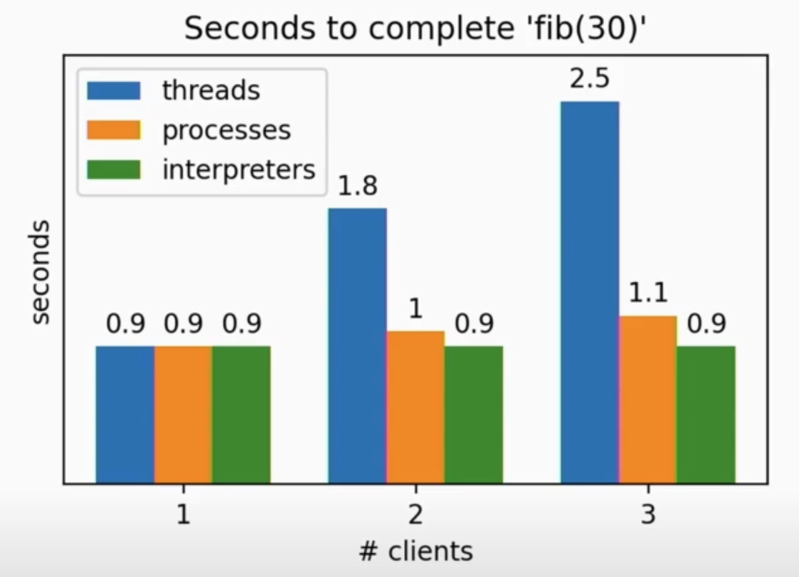
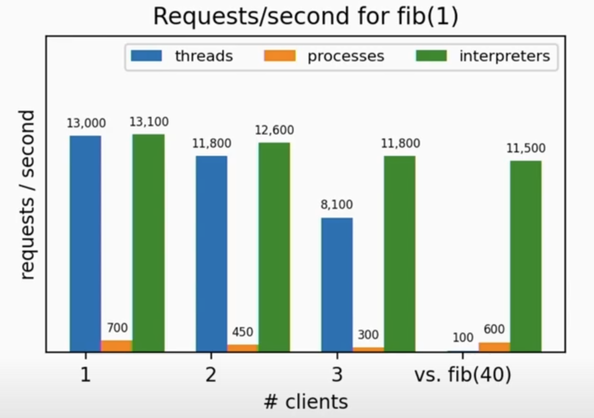

<!--more-->
## 멀티 스레딩
멀티 스레딩은 하나의 프로세스 내에서 여러 스레드를 동시에 실행하여 작업을 병렬로 처리하는 프로그래밍 기법입니다.  

각각의 스레드는 독립적으로 실행되지만, 같은 프로세스 내의 자원을 공유하므로 데이터를 효율적으로 교환하고, 병렬 작업을 처리할 수 있습니다.  

### Race Condition
하지만, 멀티 스레딩은 자원을 공유하는 만큼 공유된 데이터 처리에 대한 고려가 필요합니다.  
여러 스레드가 동시에 한 자원에 접근하게 되면 접근 순서에 따라 실행 결과가 다르거나 의도하지 않은 결과가 발생할 수 있고 이를 `Race Condition`이라고 합니다.  

다음은 Race Condition의 간단한 예시입니다.  


계좌의 잔액을 확인하고 현재 계좌에 500원만큼 입금하는 함수가 있습니다.  
계좌는 잔액이 1000원으로 시작하고 두 개의 스레드가 동시에 입금 함수를 실행하려고 합니다.  
첫 번째 스레드는 현재 잔액이 1000원임을 확인하고 잔액을 500원이 추가된 1500원으로 변경하려고 합니다.  
이때, 첫번째 스레드가 1500원으로 변경하기 전에 두번째 스레드가 접근하여 현재 잔액이 1000원임을 확인하고 잔액을 1500원으로 변경합니다.  
이후 첫번째 스레드는 잔액을 1500원으로 변경합니다.  

이러면 실제로 2000원이 되어야 하지만 1500원이 되는 문제가 발생하게됩니다.  


## Python에서의 멀티 스레딩
Python에서도 멀티 스레딩을 지원하지만 Python의 GC 방식인 `Reference Count` 때문에 문제가 발생하게 됩니다.  

Python의 모든 객체는 `reference count` 값을 가지고 객체의 할당과 해제 시에 해당 값을 관리하게 됩니다.  



Python에서 멀티 스레딩을 사용하게 되면 한 객체에 여러 스레드가 접근할 수 있게 되고, 이 `reference count`값을 변경할 때에 `Race Condition`이 발생할 수 있는 문제가 있습니다.  
`reference count`값을 잘못 관리하면 객체가 삭제되지 않아 메모리 누수가 발생하거나 객체에 대한 참조가 있음에도 객체가 삭제되는 문제가 발생할 수도 있어 Python은 GIL을 통해 해당 문제를 막도록 하였습니다.  

## Python GIL
Python의 Global Interpreter Lock(GIL)은 여러 스레드가 동시에 Python 코드를 실행하는 것을 막는 기법입니다.

즉, 동시에 오직 하나의 스레드만 실행될 수 있다는 것입니다.  

```multithreading_cpu_bound.py
import threading
import time

def cpu_bound_task():
    count = 0
    while count < 10**7:
        count += 1

def log_time(func):
    def wrapper(*args, **kwargs):
        start_time = time.time()
        result = func(*args, **kwargs)
        end_time = time.time()
        print(f"Execution time: {end_time - start_time:.4f} seconds")
        return result
    return wrapper

@log_time
def run_in_threads():
    thread1 = threading.Thread(target=cpu_bound_task)
    thread2 = threading.Thread(target=cpu_bound_task)

    thread1.start()
    thread2.start()

    thread1.join()
    thread2.join()

@log_time
def run_sequentially():
    cpu_bound_task()
    cpu_bound_task()

print("Running in threads:")
run_in_threads()

print("\nRunning sequentially:")
run_sequentially()
```

위 코드는 수를 천만까지 세는 함수 2개를 멀티 스레드 환경에서 병렬로 실행한 것과 순차적으로 실행한 것의 결과를 비교하는 예시입니다.  

다음와 같이 멀티 스레딩과 순차적 실행에 걸리는 시간의 차이가 거의 없는 것을 확인할 수 있습니다.  

```bash
$ python multithreading_cpu_bound.py
Running in threads:
Execution time: 0.4209 seconds

Running sequentially:
Execution time: 0.4320 seconds
```

그렇다면, Python에서 멀티 스레딩은 병렬로 처리되지도 않고 Context Switching 오버헤드만 발생할텐데 불필요한 것일까요?  

그것은 아닙니다.  

Python이 GIL을 사용하는 이유는 스레드가 동시에 공유 자원에 접근하는 것을 막기 위함이기에 동시에 여러 CPU가 접근하는 것은 막지만, 파일 시스템에서 데이터를 읽고 저장하는 것과 같은 I/O 작업에 대해서는 막지 않습니다.  

즉, Python의 멀티 스레딩은 CPU Bound 작업에 대해서는 성능의 향상이 없지만 I/O Bound 작업에는 병렬 처리가 가능합니다.  

```multithreading_io_bound.py
import threading
import time

def io_bound_task(task_name, delay):
    time.sleep(delay)

def log_time(func):
    def wrapper(*args, **kwargs):
        start_time = time.time()
        result = func(*args, **kwargs)
        end_time = time.time()
        print(f"Execution time: {end_time - start_time:.4f} seconds")
        return result
    return wrapper

@log_time
def run_in_threads():
    thread1 = threading.Thread(target=io_bound_task, args=("Task 1", 2))
    thread2 = threading.Thread(target=io_bound_task, args=("Task 2", 3))

    thread1.start()
    thread2.start()

    thread1.join()
    thread2.join()

@log_time
def run_sequentially():
    io_bound_task("Task 1", 2)
    io_bound_task("Task 2", 3)

print("Running in threads:")
run_in_threads()

print("\nRunning sequentially:")
run_sequentially()
```

위 코드는 I/O 작업인 sleep 함수를 2개를 멀티 스레드 환경에서 병렬로 실행한 것과 순차적으로 실행한 것의 결과를 비교하는 예시입니다.  

다음와 같이 멀티 스레딩에서는 순차적 실행과 달리 함수가 병렬로 실행된 것을 확인할 수 있습니다.  

```bash
$ python multithreading_io_bound.py
Running in threads:
Execution time: 3.0037 seconds

Running sequentially:
Execution time: 5.0084 seconds
```

따라서 Python에서는 CPU Bound 작업에 대해서는 멀티 프로세싱을, I/O Bound 작업에 대해서는 멀티 스레딩을 사용하는 것을 권장합니다.  

## GIL 문제점 해결
하지만 Python 개발자들은 이러한 GIL의 문제점에 대해서 꾸준히 문제점을 제기했고 결국 Python은 GIL의 문제점을 해결하기 위해 노력하고 있습니다.  

### 서브 인터프리터를 통한 병렬 처리
2023년 10월 2일 출시된 Python 3.12부터 서브 인터프리터 별로 개별적인 GIL을 생성하도록 업데이트 되었습니다.  

즉, Python 3.12부터 서브 인터프리터 별로 개별 GIL을 생성하며 CPU Bound 작업에서의 병렬 처리도 가능해졌지만 서브 인터프리터는 아직 `C-API`만을 제공하고 있고 Python 3.13부터 서브 인터프리터를 표준 라이브러리에 포함하려고 하고 있습니다.  

Python 서브 인터프리터란 메인 인터프리터와 동일한 프로세스와 동일한 주소 공간을 사용하여 병렬로 Python 코드를 실행하지만 완전히 독립된 자원으로 실행되는 인터프리터입니다.  

즉, OS로 부터 할당받은 프로세스의 메모리 공간을 각각의 서브 인터프리터가 독립적으로 사용하는 방식입니다.  

#### 서브 인터프리터 vs 멀티 스레딩
멀티 스레딩과 비교하면 멀티 스레드는 스레드끼리 동일한 메모리 공간을 사용하기 때문에 자원 공유가 편하지만 공유 자원에 race condition이 발생할 수 있어 동기화에 대한 고려가 필요합니다.  
반면 서브 인터프리터는 메모리 공간이 독립적이기에 자원 공유를 위해 별도의 채널을 사용해야하여 자원 공유 속도가 스레드에 비하여 느리지만 원전히 독립적으로 자원을 관리할 수 있습니다.  

#### 서브 인터프리터 vs 멀티 프로세싱
멀티 프로세싱과 비교하면 둘 다 Python CPU Bound 작업에서 코드를 병렬로 실행할 수 있게 해줍니다. 하지만 서브 인터프리터는 동일한 프로세스에서 실행되므로 더 가볍고 커뮤니케이션이 더 빠르고, 멀티 프로세스는 개별 프로세스를 통한 메모리 공간을 사용하기에 더 강한 격리 수준을 제공한다는 차이가 있습니다.  

처리 속도                    |  초당 처리 가능 요청 수
:-------------------------:|:-------------------------:
  |  

위의 표는 서브 인터프리터의 성능 지표입니다.  
더 자세한 내용은 다음 영상을 참고해주세요.  




### GIL 비활성화
Python 3.13부터는 GIL을 비활성화 하는 옵션을 실험적으로 제공할 예정이라고 합니다.  

CPython will run with the global interpreter lock (GIL) disabled when configured using the --disable-gil option at build time. This is an experimental feature and therefore isn’t used by default. Users need to either compile their own interpreter, or install one of the experimental builds that are marked as free-threaded. See PEP 703 “Making the Global Interpreter Lock Optional in CPython” for more detail.

